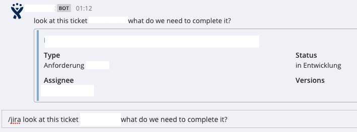

# Mattermost-Jira Bridge

## What is this?
This is a bridge between [Mattermost](https://about.mattermost.com/) an [Jira](https://www.googleadservices.com/pagead/aclk?sa=L&ai=DChcSEwjQiMSTvsPUAhUBu-0KHRmxAvMYABAAGgJkZw&ohost=www.google.de&cid=CAESEeD2IQUXvscPJrQAikjBt0O6&sig=AOD64_2nfU9Ip1lvP3NJnErY2_lh1Lz8_w&q=&ved=0ahUKEwjbnL6TvsPUAhVqLsAKHchFBX8Q0QwIJQ&adurl=).
This allows for users to use mattermost slash commands to query jira issues.



## Install dependencies
```
npm install
```
This bridge uses the [floralvikings/jira-connector](https://github.com/floralvikings/jira-connector) and [ExpressJS](http://expressjs.com/de/).

# Configure Mattermost

Configure a [Slash Command](https://docs.mattermost.com/developer/slash-commands.html#enabling-custom-commands) in Mattermost an remmeber the token.


# Authentification with JIRA
This bridge uses the oauth2 method for authentification.

## Generate keys
```
mkdir jira-key
cd jira-key/
openssl genrsa -out jira_privatekey.pem 1024
openssl req -newkey rsa:1024 -x509 -key jira_privatekey.pem -out jira_publickey.cer -days 365
openssl pkcs8 -topk8 -nocrypt -in jira_privatekey.pem -out jira_privatekey.pcks8
openssl x509 -pubkey -noout -in jira_publickey.cer  > jira_publickey.pem

```

## Jira
It is nessesary to create an [Application Link](https://confluence.atlassian.com/adminjiraserver073/using-applinks-to-link-to-other-applications-861253079.html) in JIRA.

## Configure oauth2
Visit the site [http:localhost:3000](http:localhost:3000) to complete the oauth2 configuration process and
follow the steps.

Rember to restart the server after completing the configuration.

# Docker
## Create image
```
docker build -t <myname>/mattermost-jira-bridge .
```

## Start the container
```
docker run -p 3000:3000 -d wlps/mattermost-jira-bridge
```